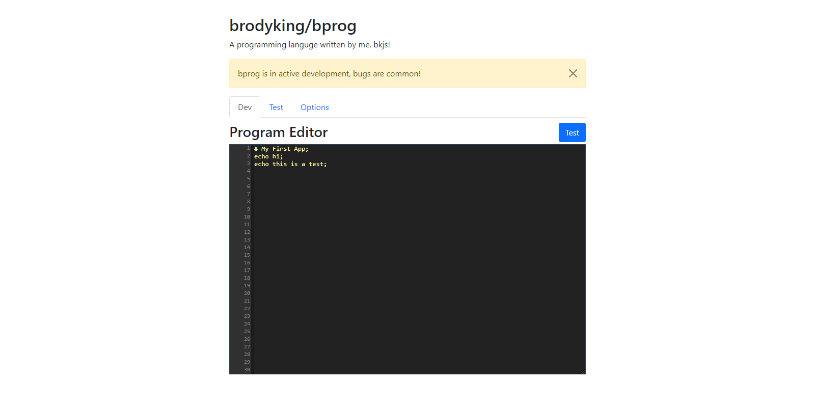

<div id="top"></div>


<!-- PROJECT LOGO -->
<br />
<div align="center">
  <a href="bprog.jpg">
    
  </a>

  <h3 align="center">bprog</h3>

  <p align="center">
    A programming language written in javascript.
    <br />
    <a href="https://bprog.bkjs.us"><strong>View Website »</strong></a>
  </p>
</div>


<!-- ABOUT THE PROJECT -->
## About The Project



bprog means "brodys programming (language)". It is basically just a different syntax that does everything javascript can do.

Here's why:
* It can be good for teaching people how to write code. (or it might make it harder, because bprog kinda sucks in its current state)
* I was really bored and wanted a project to work on.


<p align="right">(<a href="#top">back to top</a>)</p>


### Built With

I used vanilla HTML, CSS, and JS because I want it to be able to run without a web server. I like it when you can just clone a repo and everything just works. It is really annoying when you have to do a ton of setup for someone elses project.

<p align="right">(<a href="#top">back to top</a>)</p>


<!-- GETTING STARTED -->
## Getting Started

In this section, I will go in-depth about how to use bprog and its web interface.

### The layout
If you look at the top, you will see 3 tabs. The first one is Dev. This is the tab you do all of your programming in. The second tab is Test. This is the tab where you run your code. And the final tab is Options, which is currently empty because I havent found a use for it yet.

### The Syntax

You must always start your project off with a comment at the top. This is because the compiler skips the first line. You can make a comment like this:
  ```
  # This is a comment;
  ```
Make sure you have a semicolon at the end of every command. If you dont, the new line will not be detected!

To echo some text to the Test page, type this:
```
echo Hello World;
```


<!-- ROADMAP -->
## Roadmap

- [x] Create UI
- [x] Create echo and comment commands.
- [x] Create this readme file you are looking at.
- [ ] Create saving and importing files.
- [ ] variables and user input


<p align="right">(<a href="#top">back to top</a>)</p>


<!-- CONTRIBUTING -->
## Contributing

If you want to help with this project, just follow these steps.

1. Fork the Project
2. Create your Feature Branch (`git checkout -b feature/AmazingFeature`)
3. Commit your Changes (`git commit -m 'Add some AmazingFeature'`)
4. Push to the Branch (`git push origin feature/AmazingFeature`)
5. Open a Pull Request

if your feature is good, then it will probably be accepted.

<p align="right">(<a href="#top">back to top</a>)</p>


<!-- CONTACT -->
## Contact

Brody King - [bkjs.us](https://bkjs.us)

Project Link: [https://github.com/brodyking/bprog](https://github.com/brodyking/bprog)

<p align="right">(<a href="#top">back to top</a>)</p>


<!-- ACKNOWLEDGMENTS -->
## Acknowledgments

Honestly thank you to stack overflow people for anwsering my stupid questions about shift() because I am stupid. 

<p align="right">(<a href="#top">back to top</a>)</p>
